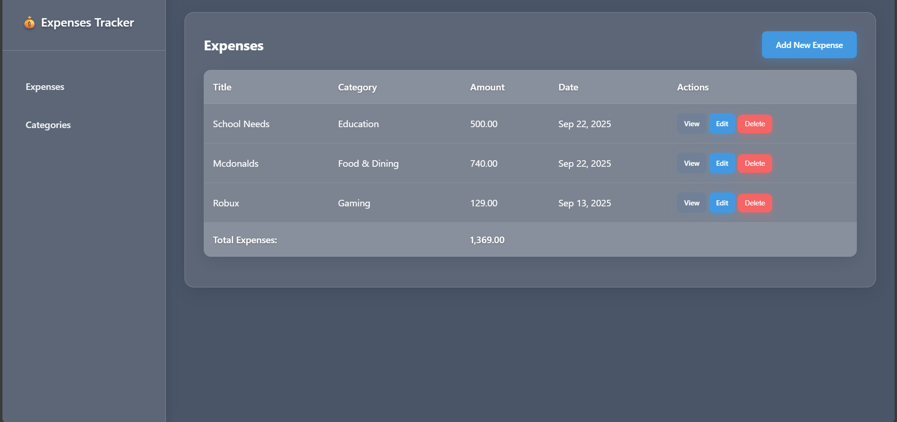
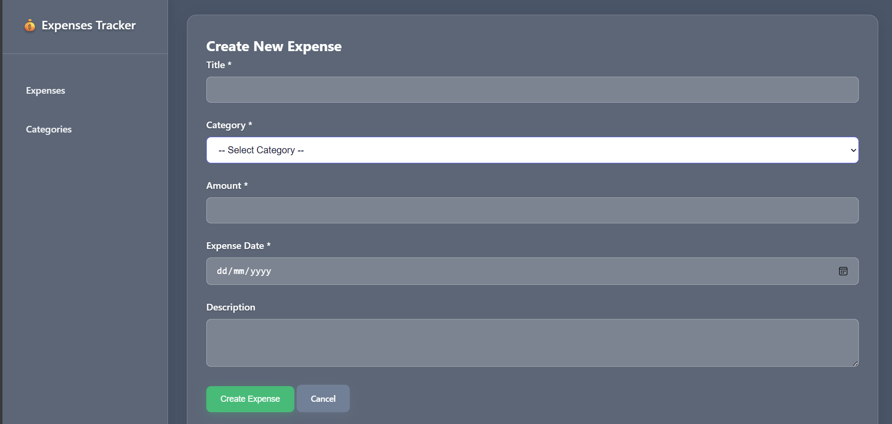
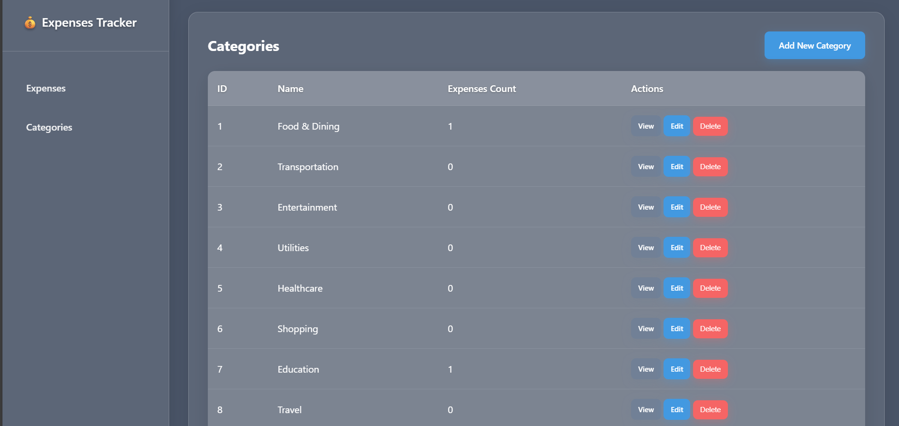

<h1 align="center">💰 <b>Expenses Tracker System</b></h1>
<h3 align="center">🧾 Midterm Project — Expenses Tracker by <b>Arianne Therese S. Amparo (4B)</b></h3>

---

##  Overview

The **Expenses Tracker System** is a simple yet effective web-based application that helps users record, manage, and analyze their daily expenses.  
It provides an organized platform to categorize spending, monitor totals, and review financial summaries with ease.

---

##  Objectives

The main objectives of this project are:

- To apply **Git and GitHub** for version control and collaboration.
- To develop a **CRUD-based system** for tracking personal expenses.
- To design a **user-friendly interface** for managing financial data.
- To demonstrate proper project documentation using **Markdown**.

---

## ⚙️ Features / Functionality

| Feature | Description |
|----------|-------------|
|  **Add Expense** | Create a new expense record by entering a title, category, amount, date, and description. |
|  **Edit Expense** | Update existing expense information as needed. |
|  **Delete Expense** | Remove an expense record from the list. |
|  **Expense Categories** | Manage categories such as “Food,” “Transportation,” and “Education.” |
|  **Expense Summary** | View total spending and analyze how funds are distributed across categories. |
|  **User-Friendly Interface** | Simple navigation and responsive design for easy use. |

---

## Installation Instructions
This section explains how to get the project running on a local machine.

1.  **Clone the repository:**
    ```bash
    git clone [https://github.com/yourusername/expenses-tracker.git](https://github.com/yourusername/expenses-tracker.git)
    ```
2.  **Navigate to the project directory:**
    ```bash
    cd expenses-tracker
    ```
3.  **Install dependencies (if applicable):**
    *Replace with your specific command, e.g., 'npm install' or 'pip install -r requirements.txt'*
    ```bash
    # npm install 
    ```
4.  **Database Setup (if needed):**
    *Briefly mention any database configuration, e.g., creating a file or running a migration.*
    > **Example:** Create a file named `database.sqlite` in the root directory.

5.  **Run the application:**
    *Provide the final command to start the server.*
    ```bash
    # npm start
    ```
6.  Open your web browser and navigate to the application's local address (e.g., `http://localhost:3000`).

---

## Usage
This section provides simple instructions on how a new user can start tracking expenses.

1.  **Adding an Expense:**
    * Click the "**Add New Expense**" button.
    * Fill out the details: **Title**, **Category**, **Amount**, and **Date**.
    * Click "**Save**."
2.  **Managing Categories:**
    * Navigate to the "**Expense Categories**" page.
    * Use the form to **add** new categories or **edit/delete** existing ones.
3.  **Viewing the Summary:**
    * Check the main dashboard for the **Expense Summary**, which displays total spending and category breakdown.

---

## 📸 Screenshots or Code Snippets
Visually demonstrating your project helps users understand its interface and functionality instantly.

### Main Expense List View


### Add New Expense Form


### **Category List View**


### Contributors 
*Arianne Therese S. Amparo (4B)* 
